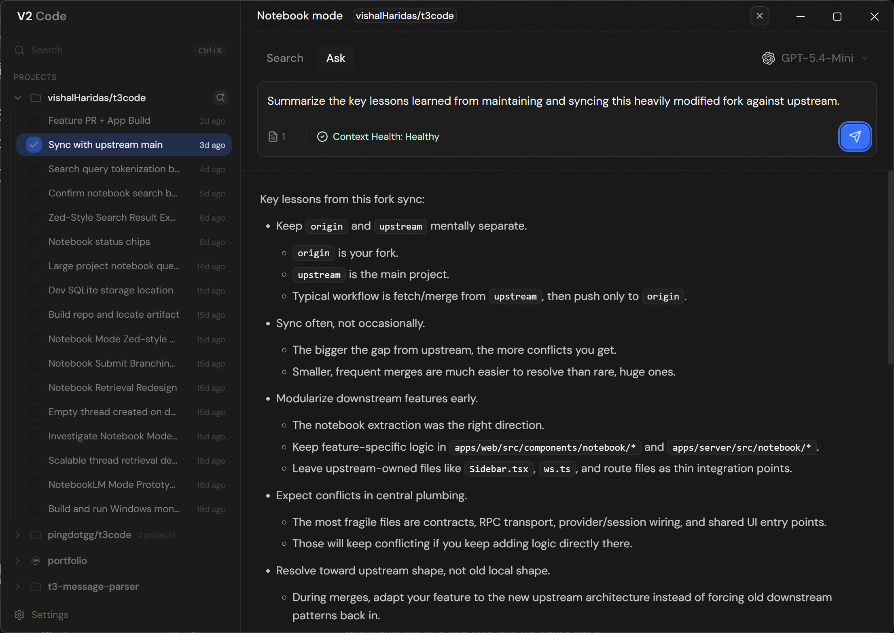

<div align="center">
  <h1>V2 Code</h1>

  <p>
    <a href="./LICENSE"></a>
    <a href="https://github.com/vishalHaridas/t3code"></a>
  </p>

  

_Query your past implementation threads_

</div>

Run instantly:

```bash
npx t3
```

Develop from source:

```bash
git clone https://github.com/vishalHaridas/t3code.git
cd t3code
bun install
bun dev
```

<sub>Forked from [T3 Code](https://github.com/pingdotgg/t3code/blob/main/README.md), originally by [@t3dotgg](https://github.com/t3dotgg) and [@juliusmarminge](https://github.com/juliusmarminge).</sub>
